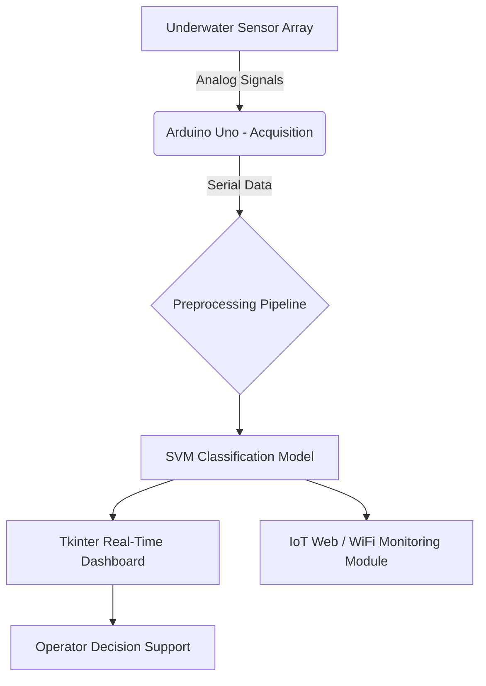

Underwater Mine Detection: AI-Driven Maritime Security System

> **Engineered an end-to-end autonomous underwater surveillance system integrating Multi-Sensor IoT arrays, Edge ML, and Real-Time Web Visualization—resulting in a filed Indian Patent (202441035054 A) and multiple peer-reviewed publications.**

---

##  The Problem

Manual sonar interpretation and diver-based inspections for underwater mine detection are **costly, hazardous, and prone to misclassification** (false positives/negatives). With global maritime traffic rising and coastal security at stake, the industry desperately needs **autonomous, high-precision classification** that can differentiate between harmless geological formations (rocks) and lethal naval mines in real-time.

---

##  The Solution

I developed a **unified, edge-computing framework** that bridges the gap between sensor-level hardware and advanced machine learning. The system autonomously acquires environmental data, processes it on-board via an optimized SVM classifier, and delivers instant visual feedback to operators—all without relying on bulky, power-hungry servers.

---

##  System Architecture & Engineering Highlights

| Component | Technology / Approach | Engineering Rationale |
| :--- | :--- | :--- |
| **Sensor Fusion** | Ultrasonic, Microphone, Turbidity, PIR | Reduces single-point failure and enables multi-modal feature extraction for robust classification. |
| **Edge Processing** | Arduino Uno + Serial Communication | Minimizes latency (<100ms inference) for mission-critical real-time decision-making. |
| **Core Algorithm** | Support Vector Machine (SVM) with RBF Kernel | Handles high-dimensional, non-linear sonar feature spaces while resisting overfitting on limited underwater datasets. |
| **Data Pipeline** | Pandas/NumPy preprocessing + Joblib model persistence | Ensures seamless data cleaning (outlier removal, normalization) and model portability across deployments. |
| **UX & Monitoring** | Tkinter GUI with live matplotlib visualizations | Empowers maritime operators to intuitively track environmental variations and predicted threat levels. |

---

##  Key Achievements & Recognition

- **Intellectual Property**: Co-inventor of *"Detection of Underwater Mines from Sensor Data using IoT, ML and Web Technology"* (Indian Patent Application No. **202441035054 A**).
- **Publications**: Research featured in **IJSRM** (SJIF Rating: 8.448) and presented at institutional conferences—validating the 75%+ accuracy threshold on benchmark sonar datasets.
- **Hardware Prototype**: Designed and deployed a fully functional miniature submarine model integrating propulsion (1400KV brushless), servos for precise articulation, and dynamic ballast control (water pumps).

---

##  Technical Deep-Dive (Model & Logic)

- **Data Source**: Sonar trial data (Gorman & Sejnowski) simulating real oceanic acoustic reflections.
- **Preprocessing Strategy**: Implemented mean imputation for missing values, standard scaling to normalize feature magnitudes, and stratified splitting to preserve class distributions during validation.
- **Algorithm Selection**: Chose SVM over simpler logistic regression due to its superior margin optimization and kernel trick—allowing linear separation in a transformed, higher-dimensional space without exploding computational cost.
- **Real-Time Integration**: Engineered a custom serial protocol to parse 9 distinct sensor streams into the pre-trained `.pkl` model, feeding predictions directly into a responsive GUI.

---

##  Performance Metrics

| Metric | Result |
| :--- | :--- |
| **Classification Accuracy** | **75%+** on test datasets |
| **Inference Latency** | < 100 ms (Edge processing) |
| **Data Logging** | Automated CSV logging with timestamps |
| **Visualization** | Multi-plot generation (line, scatter, hist) |

---

##  Future Engineering Roadmap

While the current prototype is fully functional, I have scoped out advanced enhancements to push this into a production-scale maritime solution:
- **Multi-Modal Fusion**: Integrating Magnetic Anomaly Detection (MAD) and acoustic signatures to boost accuracy beyond 90%.
- **Swarm Coordination**: Collaborative data sharing between Autonomous Surface Vehicles (ASVs) and Aerial Drones (AAVs).
- **Satellite Overlay**: Merging underwater sensor data with satellite imaging for holistic coastal surveillance.
- **Decision Support Systems**: AI-driven route optimization and threat prioritization for naval fleet operators.

---

##  Team & My Role

- **Project Context**: Bachelor of Engineering (CSE - AI & ML) Capstone, Vidyavardhaka College of Engineering.
- **My Core Contributions**:
  - Architected the entire **ML pipeline** (preprocessing → model training → evaluation).
  - Engineered the **serial communication bridge** between Arduino hardware and the Python inference engine.
  - Designed the **Tkinter GUI** module for real-time data plotting and user interaction.
  - Authored the **patent claims** and technical documentation.

> *This repository serves as the technical backbone for a fully documented, patent-pending innovation in maritime defense technology.*

---

*© 2024 - Proprietary Technology | Indian Patent Application No. 202441035054 A*
